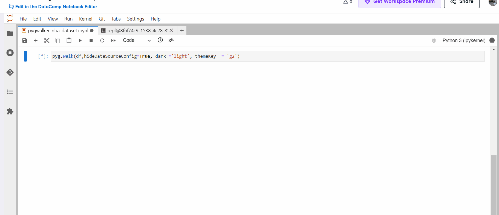

### PYGWALKER

In this repo I have shown the demo of using pygwalker library which can help to convert pandas dataframe into a visual output format with multiple options available to view data as graphs/plot as well as well formatted table.

It is simple to use:
1. Install using `pip install pygwalker`
2. Import it using `import pygwalker as pyg`
3. Pass the dataframe to `pyg.walk` function. Example `pyg.walk(df,hideDataSourceConfig=True, dark ='light', themeKey  = 'g2')`
   
### Demo

### Plots generated

